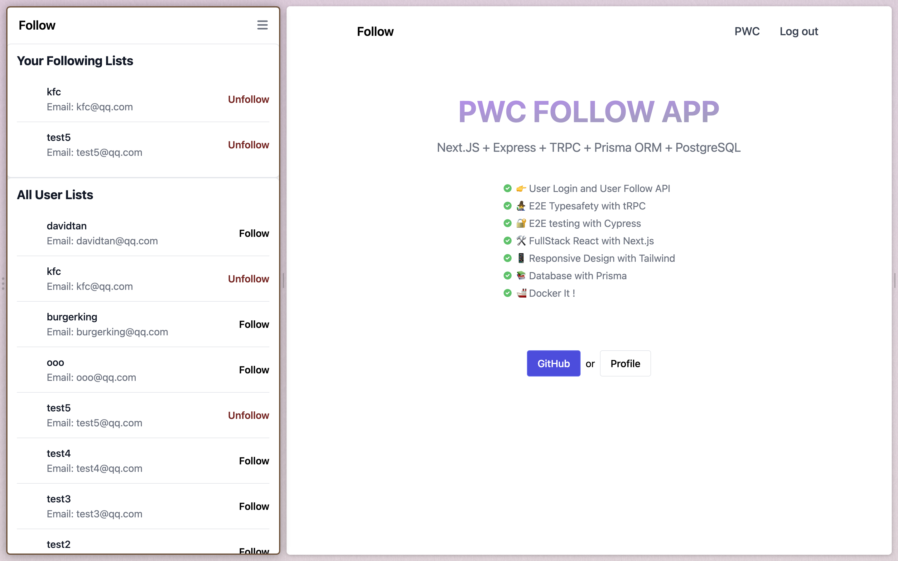

<p align='center'>

</p>

<p align='center'>
PWC Follow App</a>
</p>

<p align='center'>
<a href='https://pwcfollow.szuhy.xyz'/>👉 Goto App</a>
</p>
<br>

## Preview


https://user-images.githubusercontent.com/73568310/195546371-b4c5a6c2-30af-4d46-99e3-c5be43323699.mp4


## Features

- 🧙‍♂️ E2E Typesafety with tRPC
- 🔐 E2E testing with Cypress
- 🛠 FullStack React with Next.js
- 📱 Responsive Design with Tailwind
- 📚 Database with Prisma
- 🚢 Docker It!
- 💡 Inspired by [Create T3 App](https://create.t3.gg/)

## Use

- open https://pwcfollow.szuhy.xyz

- click Sign up to create your account
- login in your account
- redirect to profile page , you can follow other accounts

## Local Setup

- Install Dependencies

```
pnpm install
```

- Set up

```
touch .env
DATABASE_URL = "YOUR_DATABASE_URL"
// if you use other database , you should change schema.prisma file,such as
datasource db {
  provider = "sqlite"
  url      =  env("DATABASE_URL")
}

visit http://localhost:3000

```

## Docker setup

- docker-compose up --build
- visit http://localhost:3000
